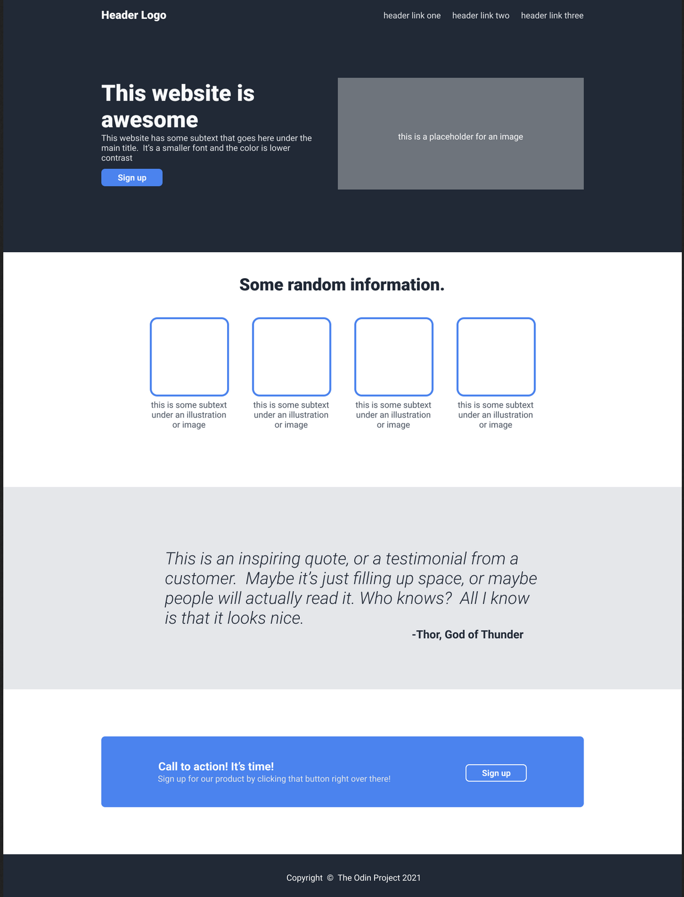

# odin-project-landing-page

This is a project in The Odin Project's [Foundation Course](https://www.theodinproject.com/lessons/foundations-landing-page). We were given a design and the font and color styles. We had to match it as much as possible. It didn't have to be an exact duplicate or be responsive. We were able substitute the content with our own, but we had to keep the same page structure.

This is the image that I had to match:

